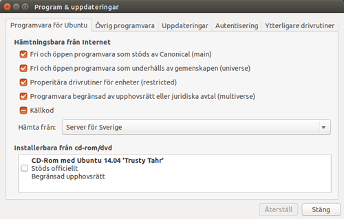
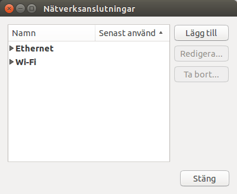
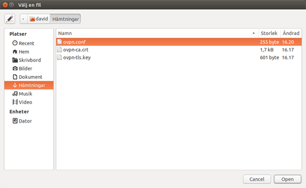
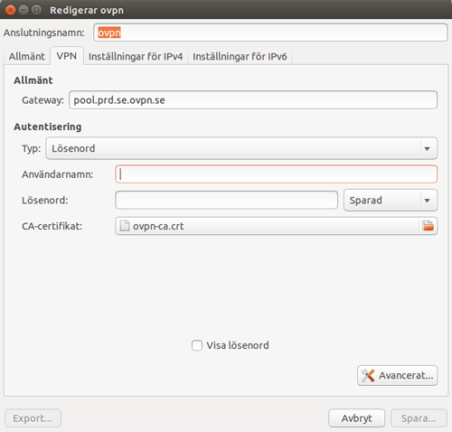
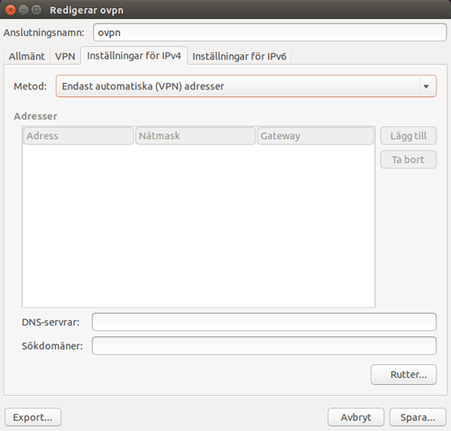
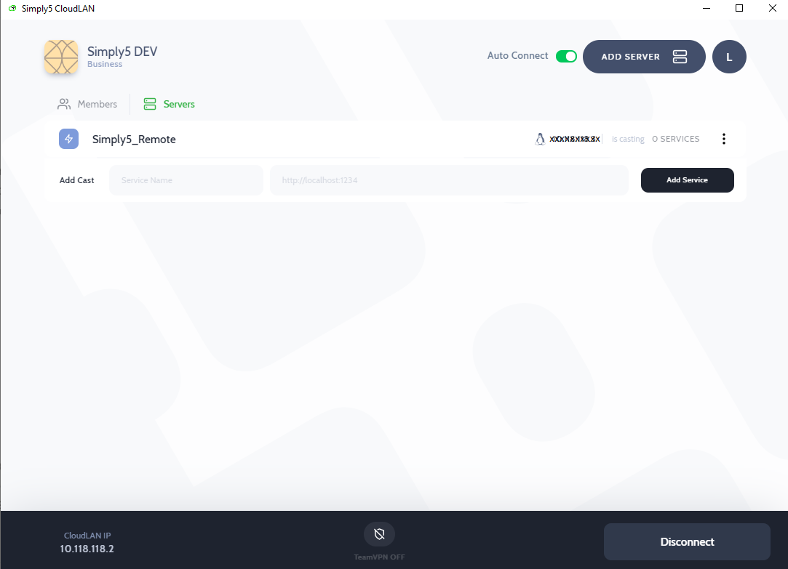

---
## Install OpenVPN for Ubuntu

### 1**. Open system settings**

- The first thing you need to do to connect to our CLoudLAN Room is to open system settings.


- Once you open **System settings**, click **Programs & updates**.
- Make sure **universe** is activated.



- If you receive a message about a software update, please approve it.
- If you receive a message asking for authentication, please enter you passwords.

### 2**. Open a new CLI**

You can open a new CLI by pressing Ctrl + Alt + t at the same time, or by searching after a CLI.Enter the following command to install needed components:

- Enter the following command to install needed components:

```basic
sudo apt-get -y install network-manager-openvpn
```

- Restart the network-manager by typing:

```basic
sudo service network-manager restart
```

### 3**. Configure the VPN-connection**

- Click the network icon in the upper right corner of the activity field and choose VPN-connections → Configure VPN.


- Click **Add**



- Choose Import a saved VPN configuration...


- Open the folder where you isntalled the configuration files, and choose ovpn.conf



### 4**. Enter your username and password and continue configuration**

- Enter the username and password you copied when downloading OpenVPN Client Config on CloudLAN App.



- Go to tab Settings for IPv4, and choose Only automatic (VPN) addresses.
- Save all the configurations you have made by clicking OK, and then Save.



### 5**. Connect to OVPN**

- Click the network icon in the upper right corner of the activity field and choose VPN-connections → ovpn.


- If the connection is successful you will see:


### 6**. Finished**

- You should now be connected to CloudLAN Room and be able to browse the internet safely. To make sure everything was set up correctly, please check [](https://www.ovpn.com/)the CloudLAN Room Servers to verify that you are connected.




---
:::info
:information_desk_person: **Something we didn't cover?**
email us at [hello@simply5.io](mailto:hello@simply5.io) or "chat with support" from our website or inside the app
:::