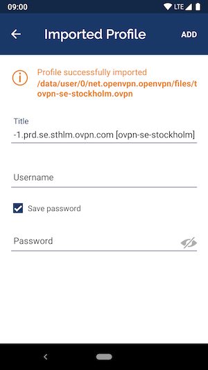
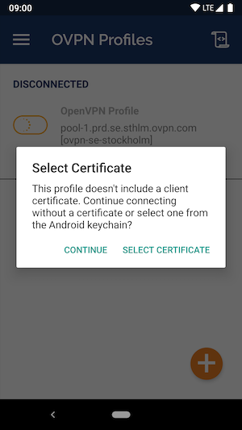
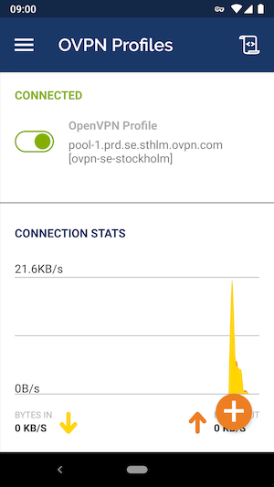

---
## Guide to install OpenVPN client for Android

### **1. Download OpenVPN Connect**

The first thing you need to do in order to connect to CloudLAN Room is to install [OpenVPN Connect for Android](https://play.google.com/store/apps/details?id=net.openvpn.openvpn&hl=en).

### 2**. Open the downloaded configuration file**

Open the configuration file that you downloaded. OpenVPN Connect should start and allow you to import the profile.

Click on OK. Enter you credentials for your OVPN account and click on Add in the top right corner when you're done.

### 3**. Connect to OVPN**

- Connect by clicking on the grey toggle that appears next to the profile name.

- It is possible that you will see a message about chosing certificate. You can discard that message and just click on Continue

- You should now be connected to OVPN and you will see

### 4**. Finished**

You should now be connected to CloudLAN Room and be able to browse the internet safely. To make sure everything was set up correctly, please check the CloudLAN Room Servers to verify that you are connected.

---
:::info
:information_desk_person: **Something we didn't cover?**
email us at [hello@simply5.io](mailto:hello@simply5.io) or "chat with support" from our website or inside the app
:::